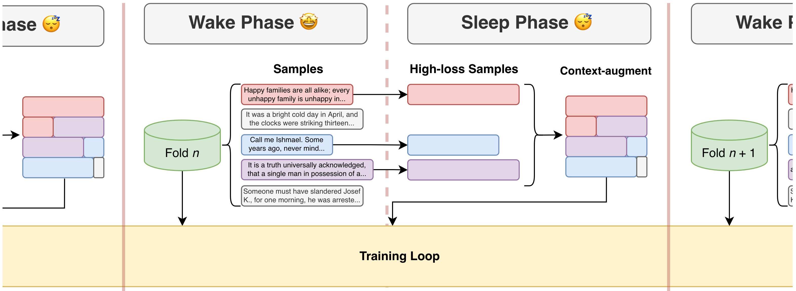

<figure>
  
  <figcaption>One phase in the Sleep Mechanism.</figcaption>
</figure>

# Sleep-Consolidated Language Modeling

### *Humans don't relive the same day ten times. Why should language models?*

Language Models (LMs), while powerful, are extremely resource-intensive to train. 
Effective LMs require hundreds of times more data to build an understanding of language than human children, often more text than a human will ever be exposed to in their entire lifetime.
Additionally, training modern language models is expensive and repetitive.
Models read the same data over and over, sometimes dozens of times, to learn effectively.
This is entirely different from how humans acquire language/knowledge: we live through every day once, and experience everything only once.
In addition to not being cognitively plausible, epoch training means that even after the model has mastered easier samples, it is still re-trained on those same samples in the same contexts as before, wasting resources and leading to overfitting.
This disconnect between the training schedules of LMs and human language acquisition could not only contribute to their inefficiency, but also means that there are strong limitations in the use and interpretation of LMs as cognitive models.

Humans, however, do revisit past experiences during sleep.
Neuroscience research has shown that sleep is not just a period of rest, but critical for developing memories.
While the waking brain is optimized for encoding new experiences into memory, during sleep, the brain undergoes a process called *memory consolidation*, where they are stabilized and integrated into pre-existing synaptic networks. 
By consolidating abstract representations of our memories in sleeping periods, humans also retain world knowledge and episodic memory of recent events (declarative memory) as well as intuition and unconscious long-term memories that influence their behavior (non-declarative memory), both of which are important for learning complex skills such as language.

It is clear that sleep is a process of utmost importance for cognitive development, and contributes to how humans are able to quickly encode and retain information from recent experiences without truly experiencing them more than once. In this project, we will explore sleep-inspired, cognitively-plausible training schedules for language models in the hopes of producing data-efficient training paradigms that diverge from standard multi-epoch conventions.


## Setup 

### Evaluation Script
BabyLM evaluation is optionally run during training, but always runs at the end of training.
Download the `evaluation_data` folder in [this OSF directory](https://osf.io/ryjfm/).
Make sure the resulting `evaluation.zip` file is stored in the root directory of this repository.

### HF Hub and WandB
In order to interact with the hub, you need to generate read and write [access tokens](https://huggingface.co/docs/hub/security-tokens) from your hugging face account. Once generated, store these values as environment variables with the names `HF_READ_TOKEN` and `HF_WRITE_TOKEN`.

Additionally, make sure you are logged in to wandb by storing your wandb API key in an environment variable called `WANDB_API_KEY`.
```
HF_READ_TOKEN = <your-read-tok>
HF_WRITE_TOKEN = <your-write-tok>
WANDB_API_KEY = <your-wandb-key>
```

### Environment Installation
Once the evaluation data is downloaded and your keys are set, run the `setup.sh` script to prepare your environment and install the evaluation pipeline.
```
./setup.sh ./evaluation_data.zip
```
If you've downloaded the eval data somewhere else, replace `./evaluation_data.zip` with the path to the data.

## Running Experiments
### Train Sleep Model

Set the appropriate hyperparameters in `conf/config.yaml`, including pointing to the correct sleep mechanism file.
You may also change the sleep hyperparameters directly in the config files within `conf/sleep_mechanism`.

For example, to train with a default set of sleep parameters, make sure in  `conf/config.yaml`, `sleep_mechanism` is set to `default`. 

Then, simply run
```
python train.py
```
This will also download and preprocess the BabyLM strict-small dataset, which is used for training.

### Run Sweep

Set your sweep ranges in the `scripts/sweep.yaml` file. Then, run 
```
python run_sweep.py
```

### Other Experiments
Various other experiments are located in different branches of this repository.
To train the corresponding model(s), switch to that branch and run `train.py`.

| **Experiment**   | **Branch**    |
|------------------|---------------|
| Gridsearch Sweep | `main`, `best_sweep_run`|
| Baselines        | `baseline_run`, `baseline_like_run` |
| Replay Experiments | `random_replay_run`, `weighted_replay_run`, `strict_replay_run`|

### Experimental Results
Results from our experiments are included in the `results` folder, including the notebook used to generate key visualizations.

## Dataset

We use one of the BabyLM Challenge datasets, a curated corpus that is designed to mimic the linguistic input that children receive during early language acquisition.
Specifically, we utilize the 10M-word strict-small text-only dataset, which roughly represents the amount of word tokens a child encounters by age 13.

This dataset is made up of a combination of sources from specifically two domains:
| **Domain**              | **Source**                     | **Description**             | **Words (M)**      | **\%**        |
|-------------------------|--------------------------------|-----------------------------|--------------------|---------------|
|*Transcribed Speech*     | OpenSubtitles                  | Movie and TV subtitles      | 31.28              | 31\%          |
|*Transcribed Speech*     | QED                            | Educational video subtitles | 10.24              | 11\%          |
|*Transcribed Speech*     | British National Corpus        | Transcribed dialogue        | 8.16               | 8\%           |
|*Transcribed Speech*     | CHILDES                        | Adult-child interactions    | 4.21               | 5\%           |
|*Transcribed Speech*     | Switchboard Corpus             | Telephone conversations     | 1.18               | 1\%           |
|                         | *Subtotal*                     |                             | *55.07*            | *56\%*        |
|*Child-Directed Language*| Simple Wikipedia               | Simplified encyclopedia     | 14.66              | 15\%          |
|*Child-Directed Language*| Wikipedia                      | Standard encyclopedia       | 10.08              | 10\%          |
|*Child-Directed Language*| Children's Book Test           | Children’s books collection | 5.55               | 6\%           |
|*Child-Directed Language*| Children's Stories Text Corpus | Selected children's stories | 3.22               | 3\%           |
|*Child-Directed Language*| Standard Project Gutenberg     | Literary texts              | 9.46               | 10\%          |
|                         | *Subtotal*                     |                             | *42.97*            | *44\%*        |
|**Total**                |                                |                             | **98.04**          | **100\%**     |


This composition is meant to reflect the oral and written language input children naturally receive, with a majority coming from spoken or conversational sources to mirror how hearing children acquire language.

## Implementation Details
### Config Files
Under `/src/config.py` you will find the general structure of the hydra config file that our program expects. The purpose of explicitly defining the structure of the config in this manner is two fold 1) to show the user the set of available configurable options 2) to run type-checking on passed in configs, ensuring that the parameters and their types match this pre-defined format. 

We run automatic type-checking on all the passed in config files, and also check that there are no missing required parameters of the config file. If there are, we raise an error.

The `/conf` directory stores all the default configs and subconfigs. The entry point to the default config we use is `conf/config.yaml`. Taking a look at the `conf` directory, you will notice that each sub-directory of `conf` (i.e. `conf/data_curriculum`) stores a sub-configuration. For sleep mechanism configurations, see the `conf/sleep_mechanism` folder. There, you'll find a default config and a minimal testing config for the sleep mechanism. Choose between which of these files to use in the `conf/config.yaml` file, as the `sleep_mechanism` argument under `defaults`.

### DataLoading 

We define a custom SleepDataLoader in `/src/dataloader.py` that subclasses the normal hugging face Dataloader class. In the SleepDataLoader, unlike in the normal DataLoader, we are able to keep track of the global step number of training (i.e. how many batches of training data have already been trained on) and indices of the data we train on. This information is useful because it allows us to configure special behavior of the Trainer for different parts of training -- this is key for the functionality of the sleep data sampling. We also implement context-augmented padding within the dataloader.

We also implement the SleepSampler, in `/src/data_curriculum/sleep_sampler.py`.
This subclasses the PyTorch Sampler, and implements much of the sleep functionality, including switching between phases, limiting access to specific folds of the data, and maintaining a replay buffer.

### Preprocessing and Tokenization

Other useful methods for data preprocessing, tokenizer and inference can be found under `src/utils`.

### Evaluation

Perplexity evaluations are done within the training script and logged to Weights and Biases.
For linguistic (BabyLM) evaluations, we use the official BabyLM Evaluation Pipeline from 2025.


### Model Architecture 

For most of our experiments, we use variants of Roberta language models. The architectures and the associated configurations are specified under `/src/models`. To associate a model name with a given huggingface model and an assocaited config, we store a registry inside of the `models` package. When we load a model we query this registry. 

## Dependencies
```
accelerate==1.12.0
aiohappyeyeballs==2.6.1
aiohttp==3.13.3
aiosignal==1.4.0
annotated-types==0.7.0
antlr4-python3-runtime==4.9.3
anyio==4.12.1
argon2-cffi==25.1.0
argon2-cffi-bindings==25.1.0
arrow==1.4.0
asttokens==3.0.1
async-lru==2.1.0
async-timeout==5.0.1
attrs==25.4.0
babel==2.17.0
beautifulsoup4==4.14.3
bleach==6.3.0
certifi==2026.1.4
cffi==2.0.0
charset-normalizer==3.4.4
click==8.3.1
comm==0.2.3
cuda-bindings==12.9.4
cuda-pathfinder==1.2.2
datasets==3.0.0
debugpy==1.8.19
decorator==5.2.1
defusedxml==0.7.1
dill==0.3.6
exceptiongroup==1.3.1
executing==2.2.1
fastjsonschema==2.21.2
filelock==3.20.0
fqdn==1.5.1
frozenlist==1.8.0
fsspec==2024.6.1
gitdb==4.0.12
GitPython==3.1.46
h11==0.16.0
hf-xet==1.2.0
httpcore==1.0.9
httpx==0.28.1
huggingface_hub==1.3.4
hydra-core==1.3.2
idna==3.11
ipykernel==7.2.0
ipython==8.38.0
ipywidgets==8.1.8
isoduration==20.11.0
jedi==0.19.2
Jinja2==3.1.6
joblib==1.5.3
json5==0.13.0
jsonpointer==3.0.0
jsonschema==4.26.0
jsonschema-specifications==2025.9.1
jupyter==1.1.1
jupyter-console==6.6.3
jupyter-events==0.12.0
jupyter-lsp==2.3.0
jupyter_client==8.8.0
jupyter_core==5.9.1
jupyter_server==2.17.0
jupyter_server_terminals==0.5.4
jupyterlab==4.5.3
jupyterlab_pygments==0.3.0
jupyterlab_server==2.28.0
jupyterlab_widgets==3.0.16
lark==1.3.1
MarkupSafe==2.1.5
matplotlib-inline==0.2.1
mistune==3.2.0
mpmath==1.3.0
multidict==6.7.1
multiprocess==0.70.14
nbclient==0.10.4
nbconvert==7.16.6
nbformat==5.10.4
nest-asyncio==1.6.0
networkx==3.4.2
nltk==3.9.2
notebook==7.5.3
notebook_shim==0.2.4
numpy==2.2.6
nvidia-cublas-cu12==12.6.4.1
nvidia-cuda-cupti-cu12==12.6.80
nvidia-cuda-nvrtc-cu12==12.6.77
nvidia-cuda-runtime-cu12==12.6.77
nvidia-cudnn-cu12==9.10.2.21
nvidia-cufft-cu12==11.3.0.4
nvidia-cufile-cu12==1.11.1.6
nvidia-curand-cu12==10.3.7.77
nvidia-cusolver-cu12==11.7.1.2
nvidia-cusparse-cu12==12.5.4.2
nvidia-cusparselt-cu12==0.7.1
nvidia-nccl-cu12==2.27.5
nvidia-nvjitlink-cu12==12.6.85
nvidia-nvshmem-cu12==3.3.20
nvidia-nvtx-cu12==12.6.77
omegaconf==2.3.0
overrides==7.7.0
packaging==26.0
pandas==2.3.3
pandocfilters==1.5.1
parso==0.8.5
patsy==1.0.2
pexpect==4.9.0
pillow==12.0.0
platformdirs==4.5.1
prometheus_client==0.24.1
prompt_toolkit==3.0.52
propcache==0.4.1
protobuf==6.33.4
psutil==7.2.2
ptyprocess==0.7.0
pure_eval==0.2.3
pyarrow==23.0.0
pycparser==3.0
pydantic==2.12.5
pydantic_core==2.41.5
Pygments==2.19.2
python-dateutil==2.9.0.post0
python-json-logger==4.0.0
pytz==2026.1.post1
PyYAML==6.0.3
pyzmq==27.1.0
referencing==0.37.0
regex==2026.1.15
requests==2.32.5
responses==0.18.0
rfc3339-validator==0.1.4
rfc3986-validator==0.1.1
rfc3987-syntax==1.1.0
rpds-py==0.30.0
safetensors==0.7.0
scipy==1.15.2
Send2Trash==2.1.0
sentry-sdk==2.51.0
shellingham==1.5.4
six==1.17.0
smmap==5.0.2
soupsieve==2.8.3
stack-data==0.6.3
statsmodels==0.14.4
sympy==1.14.0
terminado==0.18.1
tinycss2==1.4.0
tokenizers==0.22.2
tomli==2.4.0
torch==2.9.1+cu126
torchvision==0.24.1+cu126
tornado==6.5.4
tqdm==4.67.1
traitlets==5.14.3
transformers==5.0.0
triton==3.5.1
typer-slim==0.21.1
typing-inspection==0.4.2
typing_extensions==4.15.0
tzdata==2025.3
uri-template==1.3.0
urllib3==2.6.3
wandb==0.24.0
wcwidth==0.5.0
webcolors==25.10.0
webencodings==0.5.1
websocket-client==1.9.0
widgetsnbextension==4.0.15
xxhash==3.6.0
yarl==1.22.0
```

<!-- ## References
[Findings of the BabyLM Challenge: Sample-Efficient Pretraining on Developmentally Plausible Corpora](https://aclanthology.org/2023.conll-babylm.1/) (Warstadt et al., CoNLL-BabyLM 2023) -->
